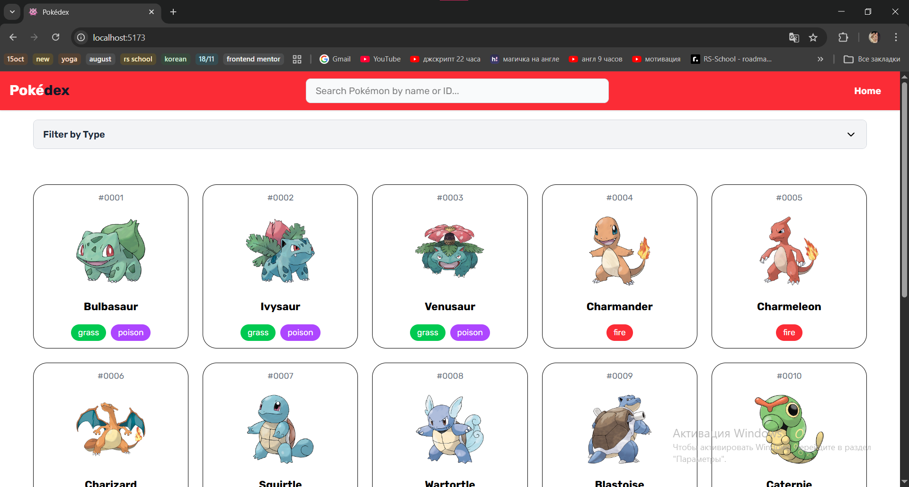
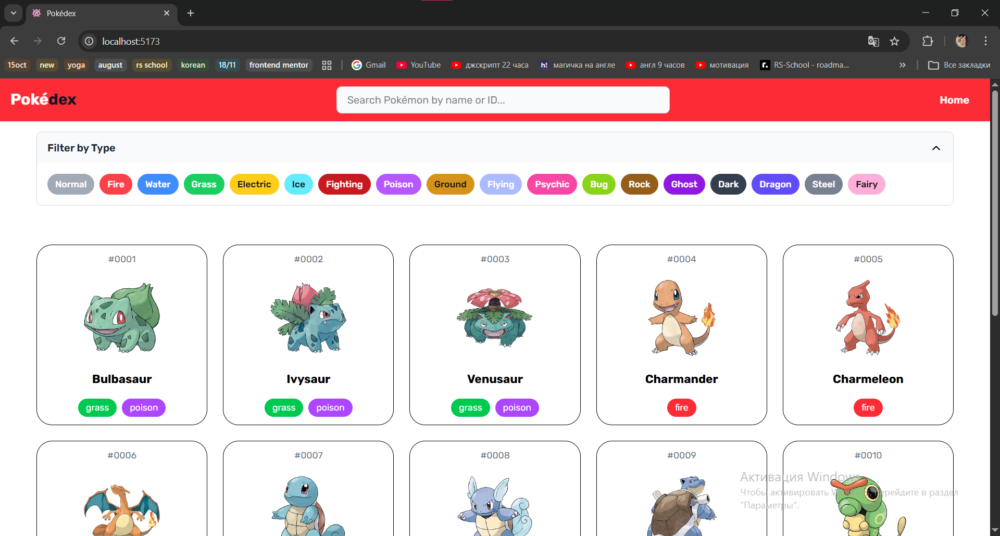
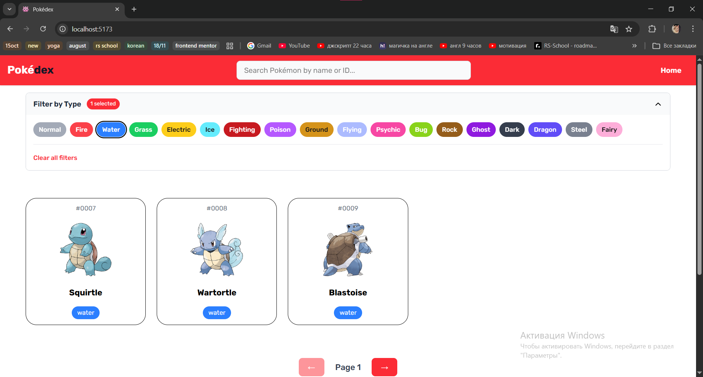
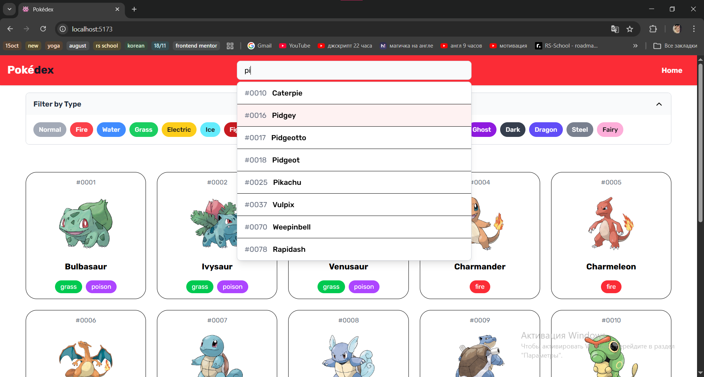
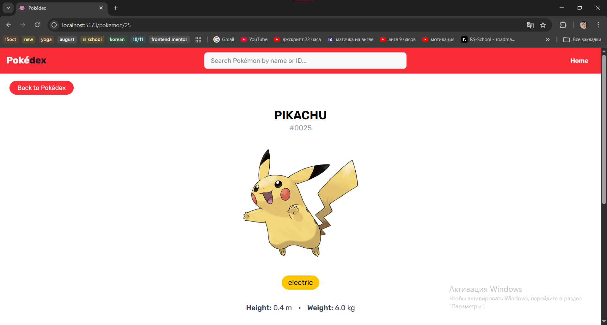
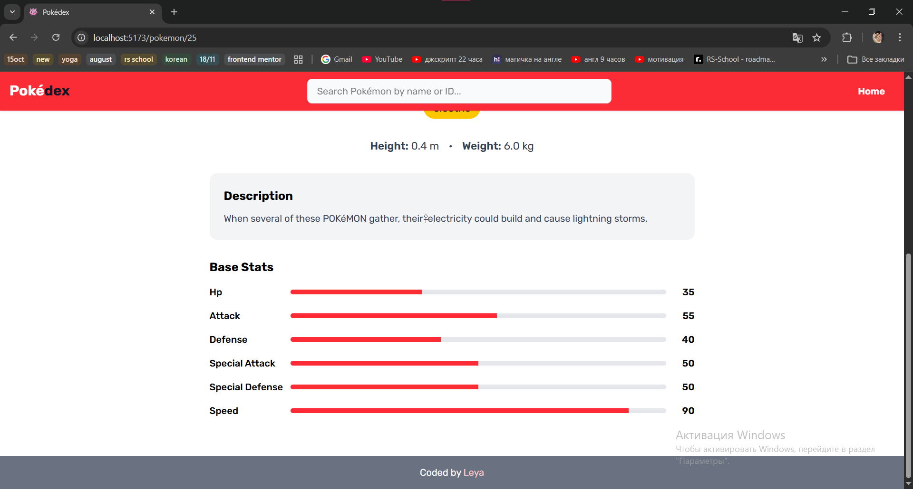

# Pokédex

## Table of contents

- [Overview](#overview)
  - [The challenge](#the-challenge)
  - [Screenshot](#screenshot)
  - [Links](#links)
- [My process](#my-process)
  - [Built with](#built-with)
  - [What I learned](#what-i-learned)
  - [Continued development](#continued-development)
- [Author](#author)
- [Note](#note)

## Overview

### The challenge

Users should be able to:  

- Browse Pokémon with pagination  
- Search Pokémon by name or ID  
- View detailed information about each Pokémon  
- Filter Pokémon by type  

### Screenshot

  
  
  
  
  
  

### Links

- Live Site URL: [pokédex](https://minleya.github.io/pokedex/)
- GitHub Repository: [pokédex repository](https://github.com/minLeya/pokedex)

## My process

### Built with
  
- Mobile-first workflow  
- Tailwind
- TypeScript
- React + React Router
- [PokéAPI](https://pokeapi.co/)

### What I learned

Using TypeScript with React is much more convenient than JavaScript thanks to types.

I used API, the following hooks have different data contents:
```typescript
usePokemonSearch - for search bar
usePokemonGrid - for home page
usePokemonDetail - for single pokemon card
```

I'm very proud of my SearchBar, which searches by both ID and Pokémon name.

### Continued development

Currently, filtering only works on the current page. I'd like to implement filtering that works across all Pokémon at once. I spent considerable time on this challenge but couldn't find a satisfying solution that both prevents API crashes from excessive requests and maintains a polished user experience.  

Adding the ability to filter Pokémon by ID.  

Expand individual Pokémon cards with more comprehensive information such as evolution chains, abilities, moves, and battle statistics.  

Implement a "Favorite Pokémon" section where users can save their preferred Pokémon. This would include a "Like" button on each Pokémon card and local storage to persist user selections.  

## Author

- Github - [Leya](https://github.com/minLeya)
- Email - moon.leya@mail.ru

## Note
This project is for educational purposes and is not affiliated with or endorsed by Nintendo, The Pokémon Company, or any of their affiliates. Pokémon and Pokémon character names are trademarks of Nintendo.